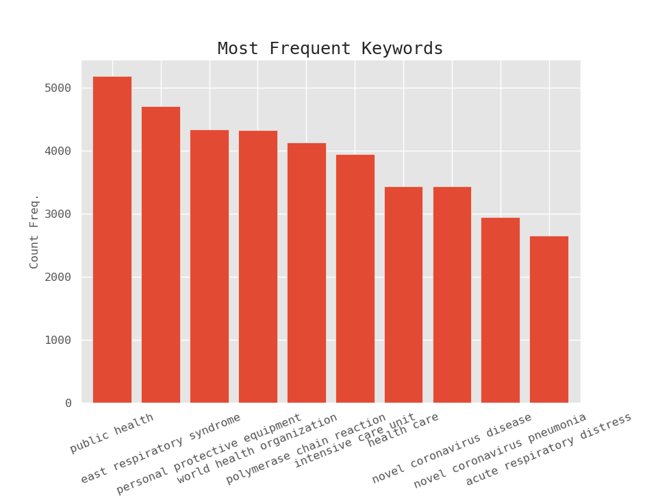

# CORD-19: COVID-19 Open Research Dataset

"Today, researchers and leaders from the Allen Institute for AI, Chan Zuckerberg Initiative (CZI), Georgetown University’s Center for Security and Emerging Technology (CSET), Microsoft, and the National Library of Medicine (NLM) at the National Institutes of Health released the COVID-19 Open Research Dataset (CORD-19) of scholarly literature about COVID-19, SARS-CoV-2, and the Coronavirus group.

Requested by The White House Office of Science and Technology Policy, the dataset represents the most extensive machine-readable Coronavirus literature collection available for data and text mining to date, with over 29,000 articles, more than 13,000 of which have full text.

Now, The White House joins these institutions in issuing a call to action to the Nation’s artificial intelligence experts to develop new text and data mining techniques that can help the science community answer high-priority scientific questions related to COVID-19."
- [White House Office of Science and Technology Policy](https://www.whitehouse.gov/briefings-statements/call-action-tech-community-new-machine-readable-covid-19-dataset/)

## Downloading the Data

Several locations:
[Kaggle](https://www.kaggle.com/allen-institute-for-ai/CORD-19-research-challenge)
[Semantic Scholar](https://www.semanticscholar.org/cord19/download)

# Overall Goal: 

The CORD dataset is a large chunk of machine readable publications that date from 1870 up until the present (within a few weeks). The dataset consists of a vast number of publications that span a variety of topics including studies on agravated respiratory conditions, international epidemics like Ebola and SARS, and the latest publications on COVID-19. The overall goal is to take this dense web of information and turn it into a comprehensive picture. 

This code attempts to do this by creating a set of topics for a given time slice (for more dense spans of time we also divide them into sub-topics), finding the most similar documents in each topic, and creating extractive summaries for the topic. These are included in the wiki for the repository.

# NLP and Visualization Python Packages
The setup shell file consists of all necessary python packages for running the code.  I will highlight a few key packages that form the backbone of the code as well as useful packages for visualization. 

* [Spacy](https://spacy.io/usage) and also (SciSpacy)[https://allenai.github.io/scispacy/] is used to perform tokenization, recognize parts of speech, pattern and phrase match, and also clean up stop words. 
* [RAKE](https://pypi.org/project/rake-nltk/}) or Rapid Automatic Keyword Extraction algorithm is used as a fairly general and also rapid keyword extraction tool for the first stage of the algorithm (Layer 1 ) to quickly extract keywords from the title and abstract
* [Fuzzy string matching](https://pypi.org/project/fuzzywuzzy/) uses the Levenshtein Distance between sequences of tokens to decide if they are synonms. Some examples include (reading frame and open reading frame, gastroentritis and transmissble gastroentritis virus). My convention is to always keep the longer N-gram (longer sequence of words)
* [NMF](https://scikit-learn.org/stable/modules/generated/sklearn.decomposition.NMF.html) or Non-Negative Matrix factorization is an unsupervised learning algorithm similar to Latent Dirichlet Allocation but converges more rapidly using a more advanced minimization technique. In this process, a document-term matrix is constructed with the weights of various terms from a set of documents. This matrix is factored into a term-feature and a feature-document matrix. The features are derived from the contents of the documents, and the feature-document matrix describes data clusters of related documents. A detailed description can be found here: [Fast Local Algorithms for Large Scale Nonnegative Matrix and Tensor Factorizations](https://www.researchgate.net/publication/220241471_Fast_Local_Algorithms_for_Large_Scale_Nonnegative_Matrix_and_Tensor_Factorizations)
* The document features are represented using [Term-Frequency Inverse Document Frequency](https://scikit-learn.org/stable/modules/generated/sklearn.feature_extraction.text.TfidfVectorizer.html) matrices. The matrix is fit and transformed to create document clusters using NMF. Rare words (with a small document frequency) that are not frequent across all documents are emphasized more with a larger TFIDF score. Cosine similarity between TFIDF vectors is used to create summaries for each topic. [Count Vectorizer](https://scikit-learn.org/stable/modules/generated/sklearn.feature_extraction.text.CountVectorizer.html) is similar but consists only of a matrix of token counts, these vectors are used to create a histogram of word counts
*  [PyTextRank](https://pypi.org/project/pytextrank/) is used for a more advanced but slower recognition of key phrases that contain the topic words. Cutting off the rank score removes more general phrases that would blow up the size of the text summaries.
* [T-distributed Stochastic Neighbor Embedding](https://scikit-learn.org/stable/modules/generated/sklearn.manifold.TSNE.html) is a tool for visualizing the topics by projecting the higher dimensional document space onto a 2D plane.  It converts similarities between data points to joint probabilities and tries to minimize the Kullback-Leibler divergence between the joint probabilities of the low-dimensional embedding and the high-dimensional data. This in effect clusters points that have similarity and pushes away dissimilar clusters. This algorithm is used to visualize topic clusters. A key tunable parameter in the algo is the [perplexity](https://distill.pub/2016/misread-tsne/) and in general it should scale with the number of features.
* [celluloid](https://pypi.org/project/celluloid/) provides gif animations from matlibplot. I use it to step though tSNE plots that scan over different number of topics. This shows visualizes how many topics might be necessary for a given time slice.

```	
bash setup.sh 
```

# CORD Crusher Main Executable

CORDCrusher.py is the main executable file that calls the set of functions in the NLP pipeline that create keywords, categorizes documents, and summaries the text. Each step is set by the -m option to run a given method.

## Creating Summaries
The first step is to choose a time range of publications to consider,the metadata file is then truncated to contain only publications in the given time frame (in the example below it is 2019 2021). PATHtoMETAData is the full path to the CORD19 data folder that contains the metadata.csv file. The argument -Y accepts a range of years so -Y 2002 2012 2019 2021 would produce three time slices for [2002, 2012] [2012, 2019],[2019, 2021] (the last range is limited to today's date) and creates output csv files as TimeSlicePapersXtoY.csv for range [X,Y]

```
python CORDCrusher.py -m TimeSlice --path PATHtoMETAData  -Y 2019 2021
```
The next step is to rake keywords in the title and abstract from the timeslice csv files. The options are similar to the above but include a number N which would correspond to the maximum number of keywords to keep by default (N=20). This step also fills in a columns of tags that flag papers based on Spacy match patterns. 

```
 python CORDCrusher.py -m RAKE -Y 2019 2021 --NRaked N
```

The step for creating topics runs the NMF topic building algorithm, stores the top 10 topic keywords, stores text lines that match topic words, also stores titles that match the raked keywords used to build the topic. To reduce the size of the files for the matched lines (thus prevent memory use to blow up down stream) we keep lines where the pyTextRank score is larger 0.02 (by default ) or a larger value of 0.04 so that the matched lines can be ranked by TF-IDF scores later. The number of topics to create is defined by setting Ntopics. 

The Era is a predefined set of time slices each of which corresponds to a summary in the twiki, the available options are:

* HumanDiseases1970to1990
* Zoonotic1970to1990
* HumanDiseases1990to2002
* Zoonotic1990to2002
* SARS2002to2005
* SARS2005to2012
* MERS
* COVID19

Topics can have a specific focus by requiring a tag (based on Spacy Match patterns), an example focus below is public health and looks for papers that have both the COVID19 tag, the PublicHealth tag as well as others that correspond to infection control measures. 

```
python CORDCrusher.py -m CreateTopics --Era COVID19andSPublicHealth --topics Ntopics  -o COVID19andSPublicHealth --pyTextRank 0.04 -Y 2019 2021 --path PATHtoMETAData
```
The above step creates a set of text files that are input for this step which ranks the documents from NMF embeddings, the matched text lines per document, and matched sentences according to the TF-IDF scores. This is the main output for creating the summaries based on the most typical papers, paragraphs and sentences.

```
python CORDCrusher.py -m CreateSummaries --Era COVID19andSPublicHealth --topics Ntopics  -o COVID19andSPublicHealth 
```
The last step is to write out the summaries to a markdown file. Matched lines and title names are reverse matched to find the URL link to the full paper. NRanked specifies how many of the highest TF-IDF items to keep (default is 5) The output markdown file contains the following set of information for the Ntopics: ,a table of the top ranked documents along with their TF-IDF score, a list of paragraphs for the highest scoring matched text lines per paper, and finally the highest scoring matched sentences. The last argument --TopicLabels gives the labels for each topic and if these are unknown you can specify numbers (e.g. for five topics --TopicLabels 0 1 2 3 4 
```
python CORDCrusher.py -m WriteSummaries --Era COVID19andSPublicHealth --topics Ntopics --topRanked NRanked -o COVID19andSPublicHealth --TopicLabels Strings Seperated by Spaces
```
Full Example for output: 

```
python CORDCrusher.py -m WriteSummaries --Era COVID19andZoo -o COVID19andZoo --topRanked 5 --topics 5 --TopicLabels "seafood wholesale market" "Phylogenetic analyses" "Porcine epidemic diarreah virus" "ACE2 receptor similarity to bat/pangolin" "antiviral drugs" 
```
This produces the summary (aside from the part that is written by me after reading it) [here](https://github.com/rpatelCERN/CORD19/wiki/COVID-19-Initial-Outbreak-and-Zoonotic-Origin-investigations)

## Supporting Code for Investigations

Using Rake for keywords abstraction can be tricky when the keywords are turned into NGrams (sequential words) as there they may be redundant or incomplete NGrams like "world health", "health organization" and "world health organization". The code in BuildNGrams.py builds a dictionary so that NGrams within a fuzzy matching distance are combined, in the above case the counts for "world health" and "health organization" would be added to "world health organization"

The before/after of the NGram output is plotted as a histogram of counts by calling: 
```
python CORDCrusher.py -m RakedKeywords -Y 2019 2021
```
This produces a histogram as seen below that can be used to eyeball key topics (like public health) and make sure the topic word is included in the NMF topics, to find stop words that could be removed due to high frequency like (sars cov), and check how well the NGrams are cleaned up (like in the above example). 


